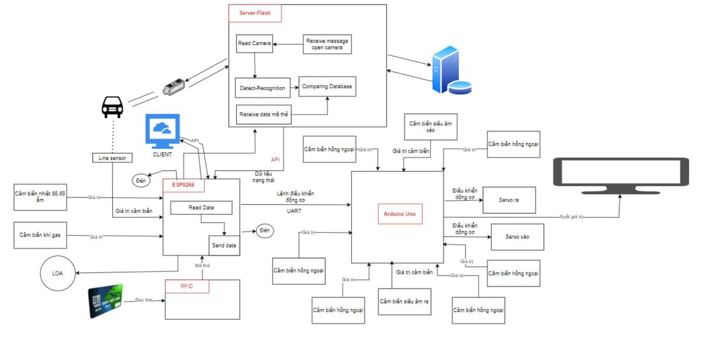
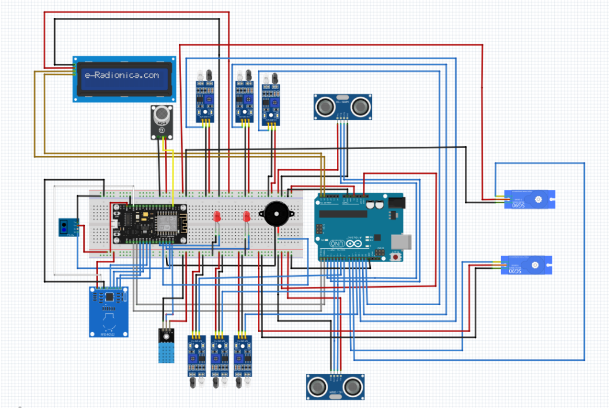
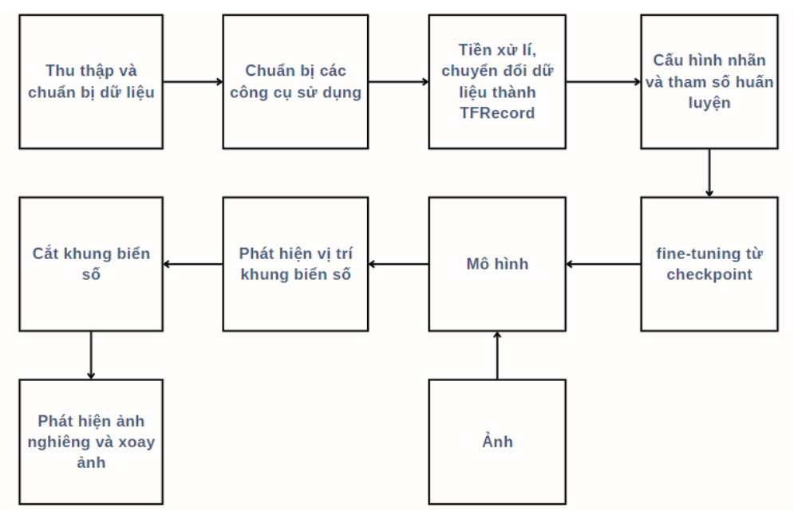
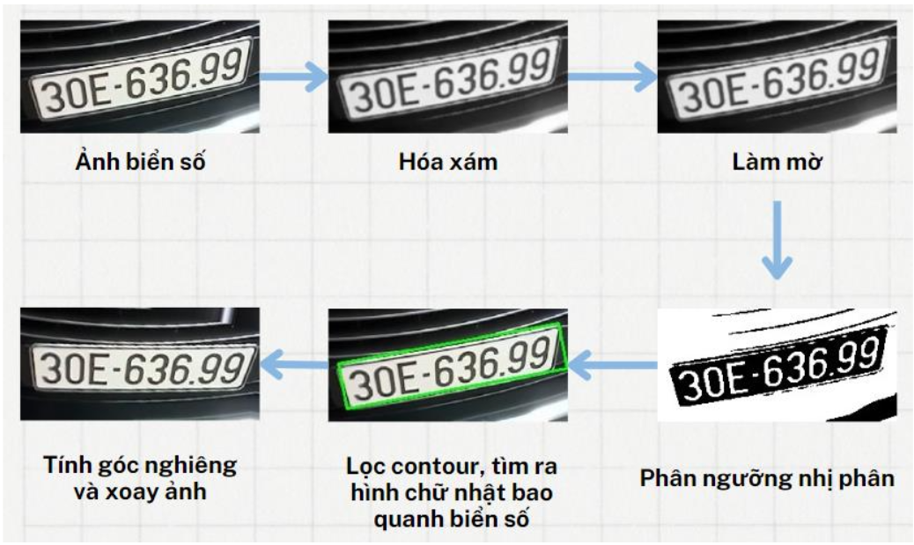
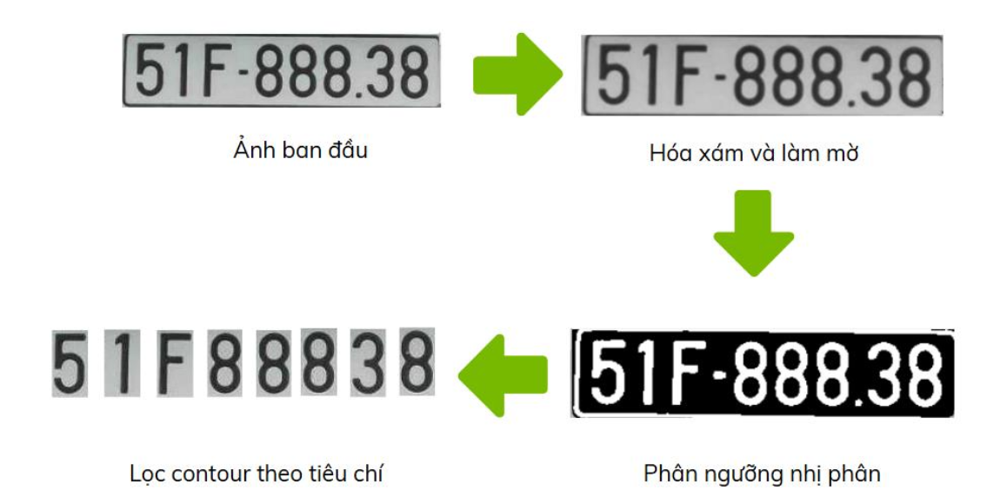
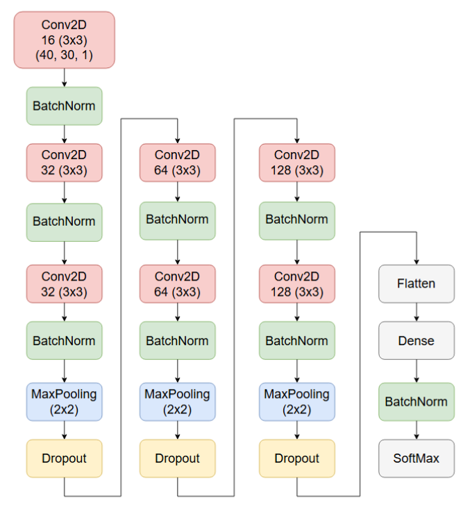
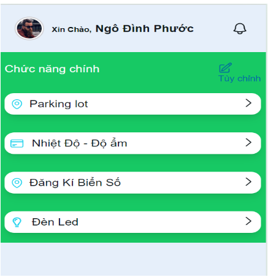
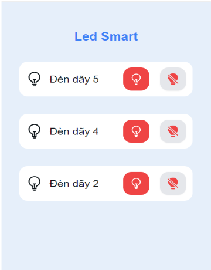
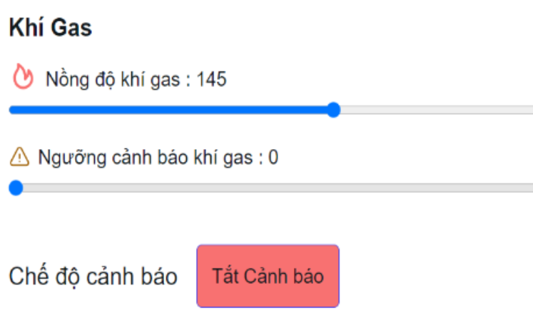
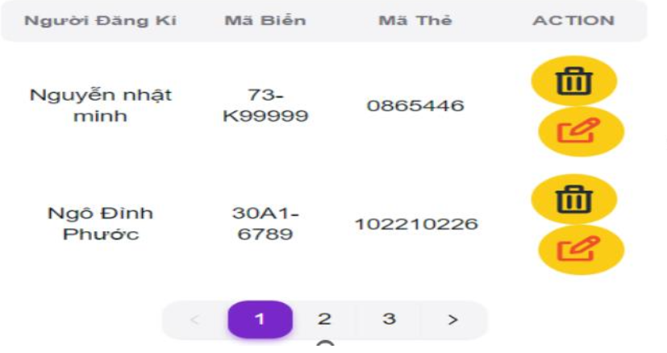

# Smart Parking System using Deep Learning & IoT

Automatic parking management system using License Plate Recognition, RFID and IoT devices.

---

## Demo Video

---

## Overview

Smart Parking System is an IoT and Deep Learning based parking management system developed using Python, ESP8266, Node.js Express, ReactJS and MongoDB.

The system combines RFID authentication and license plate recognition to automatically control parking barriers. Camera data is processed using Object Detection and CNN Classification models to detect license plates and recognize characters in real time.

In addition, the system integrates ultrasonic sensors, infrared sensors, LCD displays and servo motors to monitor parking slots, automatically control barriers and display parking availability status in real time.

---

## System Architecture

### Overall System Architecture

### Hardware Circuit Diagram

---

## Features

- License plate detection using Deep Learning
- Character recognition using CNN
- RFID authentication system
- Automatic barrier control
- Real-time parking slot monitoring
- LCD parking slot display
- Ultrasonic & infrared sensor integration
- Temperature, humidity and gas monitoring
- Real-time communication with ESP8266
- Web-based parking management dashboard

---

## System Workflow

1. Vehicle stops at the entrance barrier
2. User scans RFID card
3. Camera captures vehicle license plate
4. AI model detects and recognizes plate number
5. System validates RFID and license plate data
6. Barrier opens automatically
7. Ultrasonic sensors detect vehicle movement
8. LCD updates parking slot status in real time
9. Infrared sensors detect occupied parking slots
10. Barrier automatically closes after vehicle passes

---

## License Plate Recognition Pipeline

### Detection Pipeline

---

## Image Rotation Correction

Detected license plates are automatically corrected using contour analysis and image processing techniques before character extraction.

---

## Character Segmentation

The detected license plate is converted into binary images and segmented into individual characters using Connected Component Analysis (CCA) and contour filtering.

---

## CNN Character Classification Model

CNN architecture used for license plate character classification.

  

---

## Web Dashboard

### Main Dashboard

  

### Smart LED Control

  

### Temperature & Gas Monitoring

  

### RFID & License Plate Management

  

---

## Technologies
- Frontend: ReactJS
- Backend: Python
- Database: MongoDB
- AI/Computer Vision: TensorFlow, OpenCV, SSD MobileNet V2 FPNLite, CNN
- Hardware/IoT: ESP8266, Arduino UNO, RFID RC522, HC-SR04, Infrared Sensor, LCD1602, Servo Motor

### Contributors
- Lâm Nhật Minh
- Trần Ngọc Thanh Long
- Ngô Đình Phước
- Nguyễn Nhật Minh